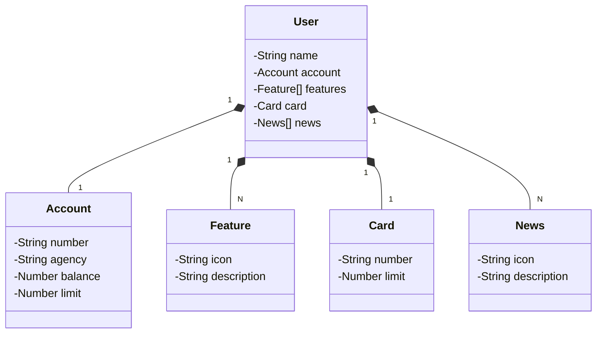

# Santander API Rest - User Service 🚀

## Technologies Used 🛠️
- Java
- Spring Boot
- Spring Data JPA
- Docker
- PostgreSQL (or your preferred database)
- Railway (for cloud deployment)

## Development Setup 🛠️
### Prerequisites 📝
- JDK (Java Development Kit) installed
- Maven or Gradle installed
- IDE (like IntelliJ IDEA, Eclipse) with Spring Boot support
- Docker (for running PostgreSQL container locally)
  
Access the deployed API:

API URL: [https://s2024api.up.railway.app](https://s2024api.up.railway.app)

# Diagrama de classes: 

